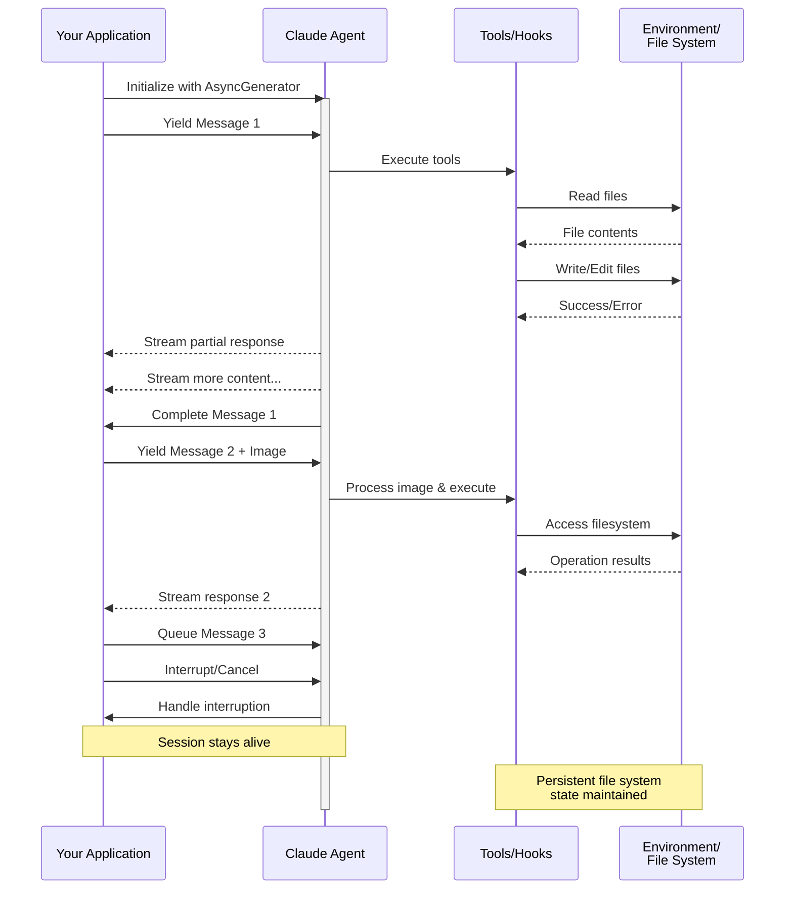

> ## 文档索引
> 获取完整文档索引：https://code.claude.com/docs/llms.txt
> 在进一步探索前，请使用此文件了解所有可用页面。

# 流式输入

> 理解 Claude Agent SDK 的两种输入模式及其适用场景

## 概述

Claude Agent SDK 支持两种不同的输入模式来与代理进行交互：

* **流式输入模式**（默认且推荐） - 持久化、交互式的会话
* **单消息输入** - 利用会话状态和恢复机制的一次性查询

本指南解释了每种模式的区别、优势和适用场景，以帮助您为应用程序选择正确的方法。

## 流式输入模式（推荐）

流式输入模式是使用 Claude Agent SDK 的**首选**方式。它能够完全访问代理的功能，并支持丰富、交互式的体验。

它允许代理作为一个长期运行的进程，接收用户输入、处理中断、展示权限请求并管理会话。

### 工作原理

### 优势


    为消息直接附加图片以供视觉分析和理解


    发送可顺序处理的多条消息，并支持中断功能


    会话期间可完全访问所有工具和自定义 MCP 服务器


    利用生命周期钩子在不同阶段自定义行为


    查看响应生成过程，而非仅查看最终结果


    自然地维护多轮对话的上下文


### 实现示例

  ```typescript TypeScript
  import { query, type SDKUserMessage } from "@anthropic-ai/claude-agent-sdk";
  import { readFile } from "fs/promises";

  async function* generateMessages(): AsyncGenerator<SDKUserMessage> {
    // First message
    yield {
      type: "user",
      message: {
        role: "user",
        content: "Analyze this codebase for security issues"
      },
      parent_tool_use_id: null
    };

    // Wait for conditions or user input
    await new Promise((resolve) => setTimeout(resolve, 2000));

    // Follow-up with image
    yield {
      type: "user",
      message: {
        role: "user",
        content: [
          {
            type: "text",
            text: "Review this architecture diagram"
          },
          {
            type: "image",
            source: {
              type: "base64",
              media_type: "image/png",
              data: await readFile("diagram.png", "base64")
            }
          }
        ]
      },
      parent_tool_use_id: null
    };
  }

  // Process streaming responses
  for await (const message of query({
    prompt: generateMessages(),
    options: {
      maxTurns: 10,
      allowedTools: ["Read", "Grep"]
    }
  })) {
    if (message.type === "result" && message.subtype === "success") {
      console.log(message.result);
    }
  }
  ```

  ```python Python
  from claude_agent_sdk import (
      ClaudeSDKClient,
      ClaudeAgentOptions,
      AssistantMessage,
      TextBlock,
  )
  import asyncio
  import base64


  async def streaming_analysis():
      async def message_generator():
          # First message
          yield {
              "type": "user",
              "message": {
                  "role": "user",
                  "content": "Analyze this codebase for security issues",
              },
          }

          # Wait for conditions
          await asyncio.sleep(2)

          # Follow-up with image
          with open("diagram.png", "rb") as f:
              image_data = base64.b64encode(f.read()).decode()

          yield {
              "type": "user",
              "message": {
                  "role": "user",
                  "content": [
                      {"type": "text", "text": "Review this architecture diagram"},
                      {
                          "type": "image",
                          "source": {
                              "type": "base64",
                              "media_type": "image/png",
                              "data": image_data,
                          },
                      },
                  ],
              },
          }

      # Use ClaudeSDKClient for streaming input
      options = ClaudeAgentOptions(max_turns=10, allowed_tools=["Read", "Grep"])

      async with ClaudeSDKClient(options) as client:
          # Send streaming input
          await client.query(message_generator())

          # Process responses
          async for message in client.receive_response():
              if isinstance(message, AssistantMessage):
                  for block in message.content:
                      if isinstance(block, TextBlock):
                          print(block.text)


  asyncio.run(streaming_analysis())
  ```

## 单消息输入

单消息输入更简单但功能也更受限。

### 何时使用单消息输入

在以下情况使用单消息输入：

*   您需要一次性响应
*   您不需要图片附件、钩子等功能
*   您需要在无状态环境中运行，例如一个 lambda 函数

### 限制

  单消息输入模式**不**支持：

  * 消息中直接附加图片
  * 动态消息队列
  * 实时中断
  * 钩子集成
  * 自然的多轮聊天

### 实现示例

  ```typescript TypeScript
  import { query } from "@anthropic-ai/claude-agent-sdk";

  // Simple one-shot query
  for await (const message of query({
    prompt: "Explain the authentication flow",
    options: {
      maxTurns: 1,
      allowedTools: ["Read", "Grep"]
    }
  })) {
    if (message.type === "result" && message.subtype === "success") {
      console.log(message.result);
    }
  }

  // Continue conversation with session management
  for await (const message of query({
    prompt: "Now explain the authorization process",
    options: {
      continue: true,
      maxTurns: 1
    }
  })) {
    if (message.type === "result" && message.subtype === "success") {
      console.log(message.result);
    }
  }
  ```

  ```python Python
  from claude_agent_sdk import query, ClaudeAgentOptions, ResultMessage
  import asyncio


  async def single_message_example():
      # Simple one-shot query using query() function
      async for message in query(
          prompt="Explain the authentication flow",
          options=ClaudeAgentOptions(max_turns=1, allowed_tools=["Read", "Grep"]),
      ):
          if isinstance(message, ResultMessage):
              print(message.result)

      # Continue conversation with session management
      async for message in query(
          prompt="Now explain the authorization process",
          options=ClaudeAgentOptions(continue_conversation=True, max_turns=1),
      ):
          if isinstance(message, ResultMessage):
              print(message.result)


  asyncio.run(single_message_example())
  ```

